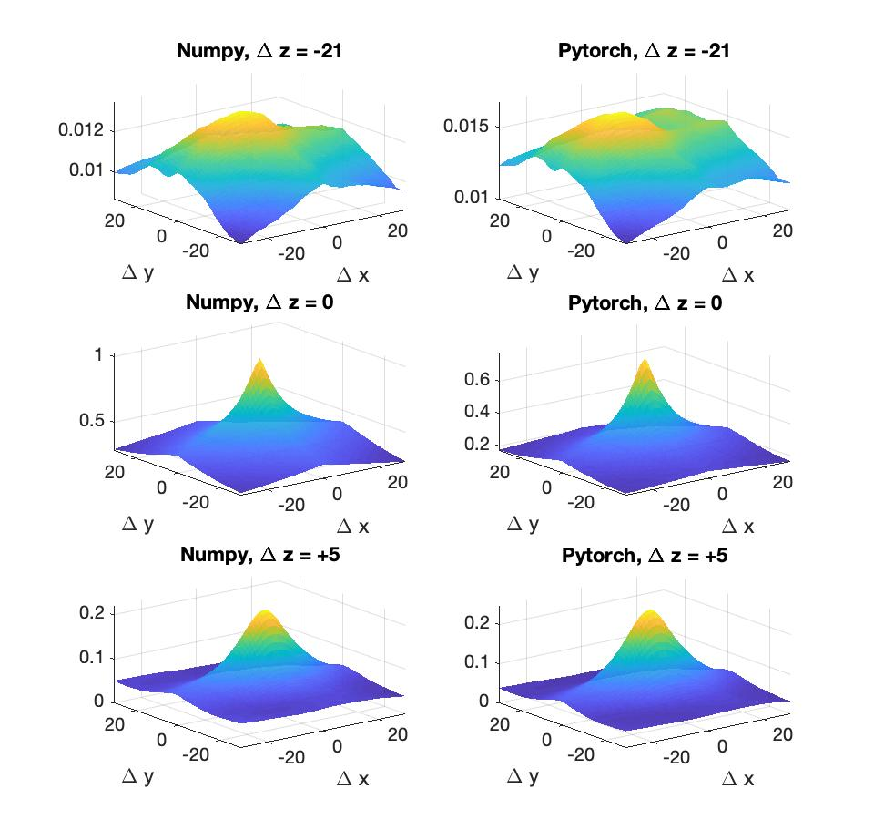

## PyTorch Implementation of a differentiable mutual information measure
This is a differentiable implementation of the mutual information (MI) metric.  

### Usage
* The differentiable MI approximation *MI_pytorch*, is defined in `pytorch_diff_mutual_info.py`.  
* Differentiable binning, *SoftHistogram1D* and *SoftHistogram2D* are also defined in `pytorch_diff_mutual_info.py`.  
* A simple demo is provided in `pytorch_diff_mutual_info.py`. 

### Notes
* Keep in mind that this is in fact an approximation for MI, due to the approximate (but differentiable) binning process used to estimate the joint 
distribution between the two inputs to the function. 

### Example
A simple example is provided to compare between the differentiable pytorch approximation and a numpy implementation (in its own an approximation due to the estimated joint distibution...). Consider two MRI 3D templates (T1 and T2 modalities), which can be downloaded from [this link](http://nist.mni.mcgill.ca/?p=947). We take a 3D slab from both templates and translate them along the three axes and calculate the MI using both implementations. Final results are presented in the image below. Left column corresponds for the numpy implementation and the right column to the pytorch implementation. Each row corresponds to a different translation along the z direction. 

### Requirements
* [PyTorch-v1.4.0](http://pytorch.org/docs/1.4.0/)
* Nibabel 3.0.0 (only for the example)
* matplotlib 3.1.1 (only for the example)
* Numpy 1.15.4 (only for the example)

### License 
* MIT License

Copyright (c) 2020 

Permission is hereby granted, free of charge, to any person obtaining a copy
of this software and associated documentation files (the "Software"), to deal
in the Software without restriction, including without limitation the rights
to use, copy, modify, merge, publish, distribute, sublicense, and/or sell
copies of the Software, and to permit persons to whom the Software is
furnished to do so, subject to the following conditions:

The above copyright notice and this permission notice shall be included in all
copies or substantial portions of the Software.

THE SOFTWARE IS PROVIDED "AS IS", WITHOUT WARRANTY OF ANY KIND, EXPRESS OR
IMPLIED, INCLUDING BUT NOT LIMITED TO THE WARRANTIES OF MERCHANTABILITY,
FITNESS FOR A PARTICULAR PURPOSE AND NONINFRINGEMENT. IN NO EVENT SHALL THE
AUTHORS OR COPYRIGHT HOLDERS BE LIABLE FOR ANY CLAIM, DAMAGES OR OTHER
LIABILITY, WHETHER IN AN ACTION OF CONTRACT, TORT OR OTHERWISE, ARISING FROM,
OUT OF OR IN CONNECTION WITH THE SOFTWARE OR THE USE OR OTHER DEALINGS IN THE
SOFTWARE.